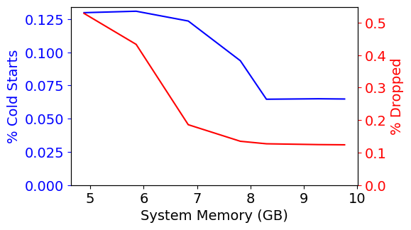
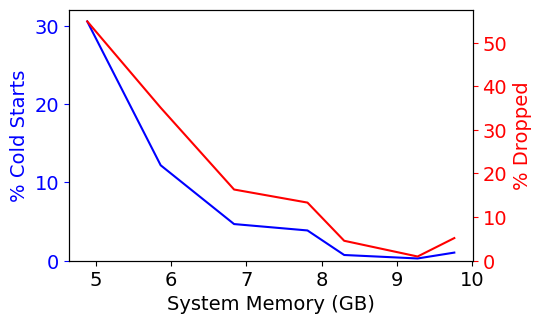
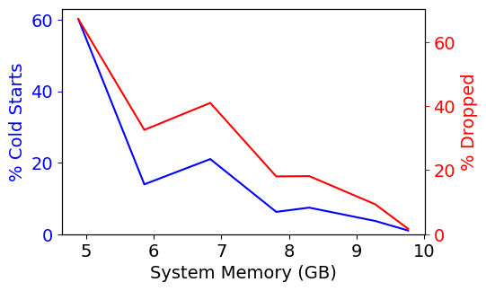
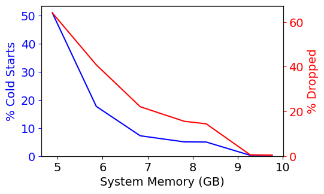
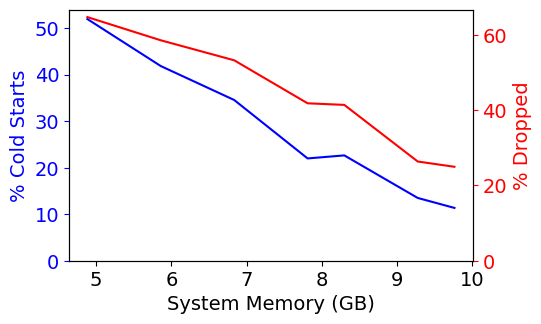
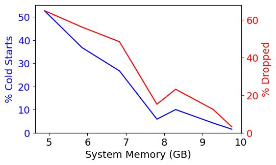

# cloud-functions-eviction-policy-simulator
Keep-alive policies for function containers to minimize the number of cold-starts. 

Simulator copied from https://github.iu.edu/alfuerst/faas-cloud-comp as part of ENGR-E 516 Engineering Cloud Computing course.

### Keep-alive algorithms implemented

---

**1. DYNAMIC MEMORY TTL (Time to live)**

- **Intuition** – This algorithm removes all containers which are not invoked in the past x mins. The minutes are calculated based on the memory available and is divided by 400 to **balance** both the cold start ratio and drop (capacity misses) ratio. 

  The dividing factor is directly proportional to cold start ratio and indirectly proportional to drop ratio. 
  
  For lower memory sizes, the TTL value is set to 6 mins.
  
  This algorithm is the **best performing** algorithm amongst all.

  ```python
  self.TTL = (self.mem_capacity // 400) * 60 * 1000 # Dynamic Memory TTL ms
  self.TTL = max(self.TTL, 6 * 60 * 1000)
  ```
  ```python
  last_invo = [(c,c.last_invo_time) for c in available]        
  last_invo_sorted = self.Sort_Tuple(last_invo,False)
  eviction_candidates = [c for c,_ in last_invo_sorted if c.last_invo_time + 
  self.TTL < self.wall_time]
  ```

---

**2. LRU (Least Recently Used)**

- **Intuition** – The strategy is to remove the least recently used containers. The algorithm tracks the invocation time for all functions and sorts them in increasing order of time before removing.
  
  ```python
  for k in eviction_candidates:
    prio = k.last_invo_time
    prio_eviction_list.append((k,prio))
  ```
---
**3. LFU (Least Frequently Used)**

- **Intuition** – In this algorithm, the least frequently used/called functions are removed. On every invocation, the algorithm keeps track of the number of times the function was called and then evicts those which are invoked the least number of times. Surprisingly, this algorithm is the poorest performing amongst all.
  
  ```python
  for k in eviction_candidates:
    prio = self.freq[k.metadata.kind]
    prio_eviction_list.append((k,prio))
  ```
---
**4. RUNTIME_DIFF (Runtime Differential)**

- **Intuition** – The runtime differential algorithm is based on the cost of warm_time / cold_time and removes those with the smallest values first.

  ```python
  for k in eviction_candidates:
    run_time = k.metadata.run_time
    if(k.metadata.run_time == 0):
        run_time = 1
    cost = k.metadata.warm_time / run_time
    prio_eviction_list.append((k,cost))
  ```
---
**5. COLD_COST (Cold Processing Cost)**
  
- **Intuition** – This algorithm removes containers based on the cold processing time. The containers with the highest cold processing time are removed first.
  
  ```python
  for k in eviction_candidates:
    cost = self.ColdHitProcTime(k.metadata)
    prio_eviction_list.append((k,cost))

  prio_eviction_list = self.Sort_Tuple(prio_eviction_list,True)
  ```
---

### Analysis
Amongst all algorithms, the **Dynamic TTL** is the best performing. 

After that, LRU also beats random algorithm and works pretty well across a range of input functions.

All algorithms are implemented keeping in mind that they should work across all the general inputs.

---

### Graphs
All graphs can be seen in the `graphs` folder.

### Results for 100-a



&emsp;&emsp;&emsp;&emsp;&emsp;&emsp;&emsp;&emsp;&emsp;&emsp;&emsp;&emsp;&emsp;&emsp;&emsp; **DYNAMIC TTL**



&emsp;&emsp;&emsp;&emsp;&emsp;&emsp;&emsp;&emsp;&emsp;&emsp;&emsp;&emsp;&emsp;&emsp;&emsp; **LRU**



&emsp;&emsp;&emsp;&emsp;&emsp;&emsp;&emsp;&emsp;&emsp;&emsp;&emsp;&emsp;&emsp;&emsp;&emsp; **LFU**



&emsp;&emsp;&emsp;&emsp;&emsp;&emsp;&emsp;&emsp;&emsp;&emsp;&emsp;&emsp;&emsp;&emsp;&emsp; **RAND**



&emsp;&emsp;&emsp;&emsp;&emsp;&emsp;&emsp;&emsp;&emsp;&emsp;&emsp; **RUNTIME DIFFERENTIAL**



&emsp;&emsp;&emsp;&emsp;&emsp;&emsp;&emsp;&emsp;&emsp;&emsp;&emsp;&emsp;&emsp;&emsp; **COLD COST**
